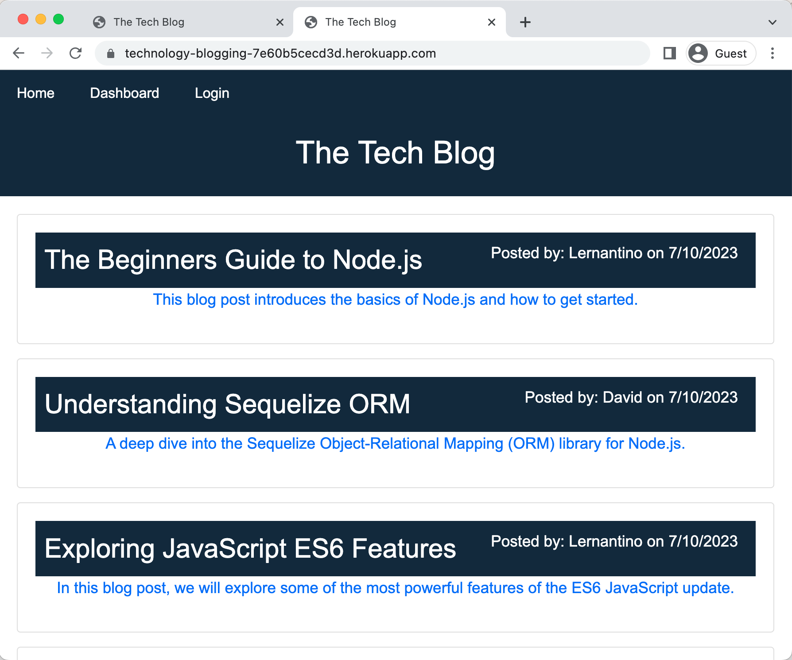

# technology-blogging

This is a blog for full stack technology.  It is a CMS-style blog site similar to a Wordpress site, where developers can publish their blog posts and comment on other developers’ posts as well.


## User Story

```md
AS A developer who writes about tech
I WANT a CMS-style blog site
SO THAT I can publish articles, blog posts, and my thoughts and opinions
```

## Acceptance Criteria

```md
GIVEN a CMS-style blog site
WHEN I visit the site for the first time
THEN I am presented with the homepage, which includes existing blog posts if any have been posted; navigation links for the homepage and the dashboard; and the option to log in
WHEN I click on the homepage option
THEN I am taken to the homepage
WHEN I click on any other links in the navigation
THEN I am prompted to either sign up or sign in
WHEN I choose to sign up
THEN I am prompted to create a username and password
WHEN I click on the sign-up button
THEN my user credentials are saved and I am logged into the site
WHEN I revisit the site at a later time and choose to sign in
THEN I am prompted to enter my username and password
WHEN I am signed in to the site
THEN I see navigation links for the homepage, the dashboard, and the option to log out
WHEN I click on the homepage option in the navigation
THEN I am taken to the homepage and presented with existing blog posts that include the post title and the date created
WHEN I click on an existing blog post
THEN I am presented with the post title, contents, post creator’s username, and date created for that post and have the option to leave a comment
WHEN I enter a comment and click on the submit button while signed in
THEN the comment is saved and the post is updated to display the comment, the comment creator’s username, and the date created
WHEN I click on the dashboard option in the navigation
THEN I am taken to the dashboard and presented with any blog posts I have already created and the option to add a new blog post
WHEN I click on the button to add a new blog post
THEN I am prompted to enter both a title and contents for my blog post
WHEN I click on the button to create a new blog post
THEN the title and contents of my post are saved and I am taken back to an updated dashboard with my new blog post
WHEN I click on one of my existing posts in the dashboard
THEN I am able to delete or update my post and taken back to an updated dashboard
WHEN I click on the logout option in the navigation
THEN I am signed out of the site
WHEN I am idle on the site for more than a set time
THEN I am able to view posts and comments but I am prompted to log in again before I can add, update, or delete posts


## Installation
  
to install for running in localhost, just exceute the following:

  ```md
  npm i 
  ```

that would install the following package:
1.  Express.  It is a fast, and minimalist web framework for Node.js that simplifies the process of building web applications and APIs by providing a robust set of features for routing, middleware, template engines, and more.

2.  mysql2. It is a fast, robust and efficient Node.js package for MySQL database connectivity, and full protocol implementation.

3.  Sequelize.  It is a promise-based Node.js ORM for Postgres, MySQL, MariaDB, SQLite, and Microsoft SQL Server, that provides robust database interactions and an easy-to-use API for tasks such as data modeling, querying, and transaction handling.

4.  dotenv.  It is a zero-dependency Node.js module that loads environment variables from a .env file into process.env, providing a way to define secret keys, database credentials, and other environment-specific details that should not be in source code.

5.  express-handlebars. It is a popular templating engine for Node.js and Express.js applications, providing a way to render dynamic HTML templates with data.

6.  Bcrypt. it is a widely used library in Node.js that provides secure hashing and salting of passwords, ensuring the storage and comparison of passwords are protected 

for heroku application, no need installation, just go to:

https://technology-blogging-7e60b5cecd3d.herokuapp.com/


## Technologies Used

This application is built using the following technologies:

- **JavaScript**: Programming language for adding interactivity and dynamic content.
- **NodeJS**: an open-source, cross-platform, JavaScript runtime environment that executes JavaScript code outside of a web browser.
- **MySQL**: It is an open-source relational database management system that enables efficient storage, retrieval, and management of structured data for various applications and websites.
- **Sequelize**: An Object-Relational Mapping (ORM) library for Node.js that provides an abstraction for database operations, supports multiple databases, and offers features like transaction control, relations, etc.
- **Express**: A minimal and flexible Node.js web application framework that provides a robust set of features for web and mobile applications, such as routing, and middleware setup.
- **dotenv**: A zero-dependency Node.js module that loads environment variables from a .env file into process.env, allowing the management of private credentials in a safe and modular way.
- **express-handlebars**: It is a popular templating engine for Node.js and Express.js applications, providing a way to render dynamic HTML templates with data.
- **bcrypt**: it is a widely used library in Node.js that provides secure hashing and salting of passwords, ensuring the storage and comparison of passwords are protected against common security vulnerabilities

## Usage

The user should clone the repository and run 'npm i' to install the following: 
- express
- mysql2
- sequelize
- dotenv
- express-handlebars
- bcrypt

database setup:
run 'npm run seed' to setup the seeds data

for localhost:
then run 'npm run start' to invoke the online store backend.

for heroku application, no need installation, just go to:

https://technology-blogging-7e60b5cecd3d.herokuapp.com/




## Features

The application is capable of the full functionality of blog 
Include the all the Restful CRUD operations on blog:

1.  Get all/Get any
2.  Post
3.  Put
4.  Delete
for all the blog post.

besides, it will have the functionality on creating comment upon different blog post.

Moreover, it has sign-up/log-in features for user to create post, add comments and so on.
without login, only Get all blog posts are shown.


## Tests

Testing done on:

User Authentication:
1.  Sign up a new user
2.  Logout after sign up
3.  Login with the existing user
4.  Logout with the existing user
5.  load a blog without Log in
6.  load a myblog without log in

Blog RESTFUL operations
1.  Get all blog posts with user login
2.  Get all blog posts without user login
3.  Get a particular blog post after user log in
4.  Create a new blog post after user login
5.  Update a blog post after user login
6.  Delete a blog post after user login
7.  add a new comment on your blog post
8.  add a new comment on not own blog post.


## Resources

Link to Heroku:

https://technology-blogging-7e60b5cecd3d.herokuapp.com


Link to GitHub repo:

https://github.com/percivalho/technology-blogging.git


## License 


## Credits and Copyright 
&copy; Copyright 2023 - Present. Percival Ho